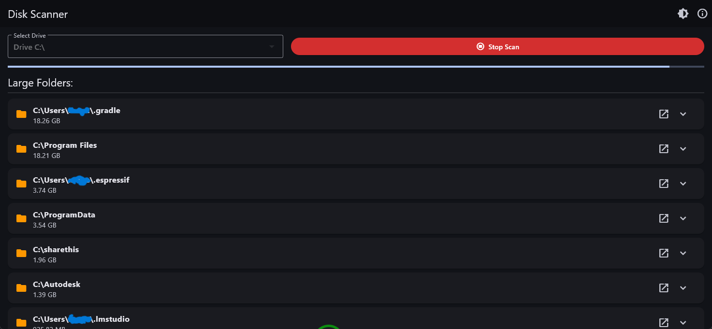
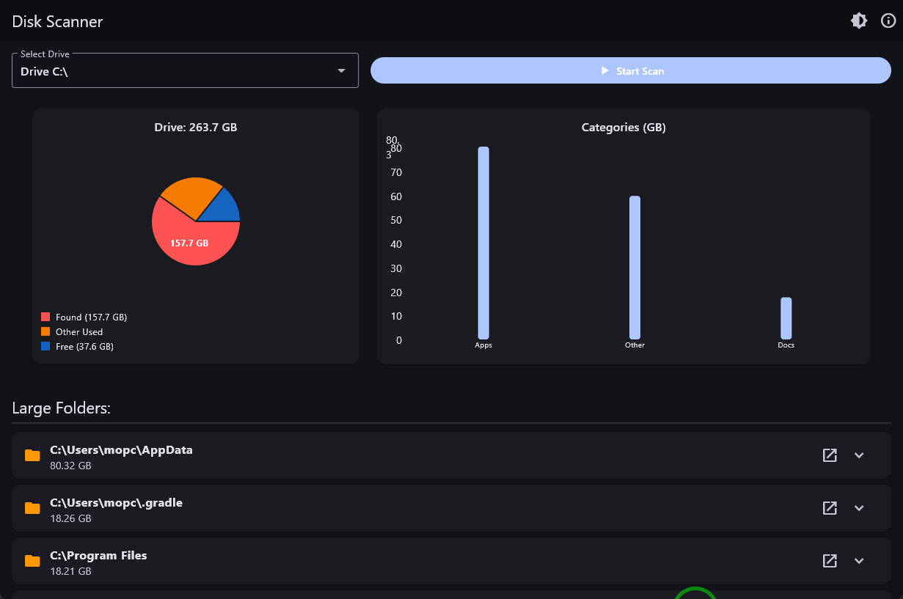

## Disk Space

Disk Space is a tiny program written in Dart/Flutter to help you see what takes your disk space too much *(it will have some features but for now only searching among more than 500 MB folders)*.

# Features for Todo:
Settings:
1.Scan specific folder,
2.Dont scan specific folder,
3.Adding more clear chart,
And anything you request or i find it helpful in future.
.

Created for poor people ( like me ) who is busy by mortza mansory.
